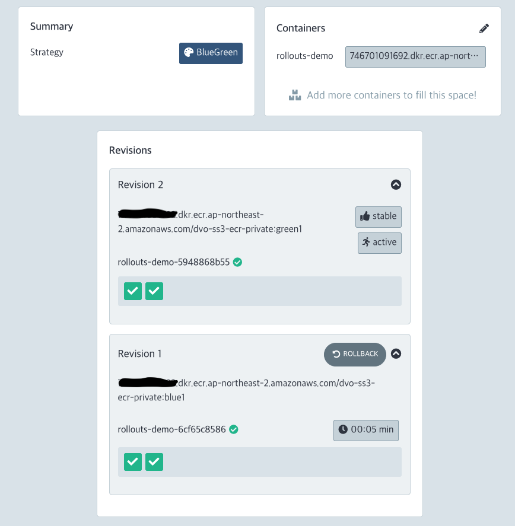

2023년 04월 ArgoCD Installation & Configuration
================================================

# Summary
- Last Updated: 23.05.01 Mon
- Updated by: 황동욱

# 배경

ArgoCD 구축하고 배포를 진행 한다.

# GitOps Pipeline


# 구축

## 시스템 구성

- ArgoCD 는 Helm 으로 구축 함
    - 식스샵3 개발 EKS 내에 argocd 네임스페이스를 하나 만듬
    - AWS ALB Controller 를 이용하여 ALB 를 구성
    - 도메인을 연결하고 SSL 인증서 연결함
- ArgoCD URL : secretdomain
- ArgoCD Rollout URL : secretdomain
- 구성된 Pods 는 아래와 같음

```bash
NAME                                                READY   STATUS    RESTARTS   AGE
argo-rollouts-5656b86459-fccwq                      1/1     Running   0          2d10h
argo-rollouts-5656b86459-grzfn                      1/1     Running   0          2d10h
argocd-application-controller-0                     1/1     Running   0          38m
argocd-applicationset-controller-84fc4b6cc8-tmwxp   1/1     Running   0          8h
argocd-dex-server-f48dd5854-qfmzd                   1/1     Running   0          8h
argocd-notifications-controller-7558dd75dd-89brq    1/1     Running   0          8h
argocd-redis-56749b86c4-qfgl8                       1/1     Running   0          38m
argocd-repo-server-7ff746dc78-9q57h                 1/1     Running   0          38m
argocd-repo-server-7ff746dc78-spmkh                 1/1     Running   0          38m
argocd-server-75ccfd9f-ft7gm                        1/1     Running   0          38m
argocd-server-75ccfd9f-ww5ms                        1/1     Running   0          38m
```

## Repository 인증

- ArgoCD 는 Gitops 로서 Github 를 상시 바라보고 있다가 변경 사항이 있으면 자동으로 감지하여 배포함
- Github 인증 방식에는 여러가지가 있는데 Github 토큰 인증을 사용함
    - **액세스 토큰 생성**
    - **Cluster 연동**
        - argocd cli 를 먼저 설치해야 함
            - `brew install argocd`
        - EKS Cluster 연결

    ```bash
    argocd cluster add arn:aws:eks:ap-northeast-2:secret:cluster/dvo-ss3-dev-eks
    ```

    - Project - Repository 구성
        - 이때 위에 생성한 Github 액세스 토큰을 이용하여 Repository 를 연동시켜 줌

        

## Auto Sync

- ArgoCD 의 주요 기능은 `Auto Sync` 임
- SYNC POLICY
    - PRUNE RESOURCES
        - 기본적으로(안전 메커니즘) Auto Sync 는 ArgoCD에서 리소스가 더 이상 Git 에 정의되어 있지 않음을 감지할 때 리소스를 삭제하지 않음
        - 리소스를 정리하기 위해 항상 수동 동기화를 수행할 수 있음
    - SELF HEAL
        - Github 소스를 바라보며 ArgoCD 가 지속적으로 Sync 맞추려고 함
        - Auto Sync 는 애플리케이션이 OutOfSync 인 경우에만 수행됨


## 배포

- APP 을 새로 등록 후 배포하면 아래와 같이 배포가 됨


## Blue/Green 배포

- ArgoCD 에서는 여러 배포 전략들이 있음
    - Blue/Green
    - Canary
- 그 중에서 Blue/Green 배포로 PoC 진행
- 배포 기능을 사용하려면 `Argocd-Rollout` 을 추가로 구성해야 함`(필수)`
    - 이번에는 확인을 위해 `Rollout 대시보드` 까지 구성을 했음

- (Blue) Active Service
    - 간단하게 Hello, Blue 가 출력되는 웹


- 웹에서 확인


- Blue 서비스가 돌고 있다가 Green 으로 수정 배포가 나가는 시나리오
    - Green 배포 후에 Auto-Sync 기능으로 Green 배포가 됨
    - Green 시스템에 문제가 없다면 Green 으로 대체가 됨


- Rollout 대시보드에서 확인



- 웹에서 확인


# 결론

ArgoCD 는 흠 잡을데가 없다.

