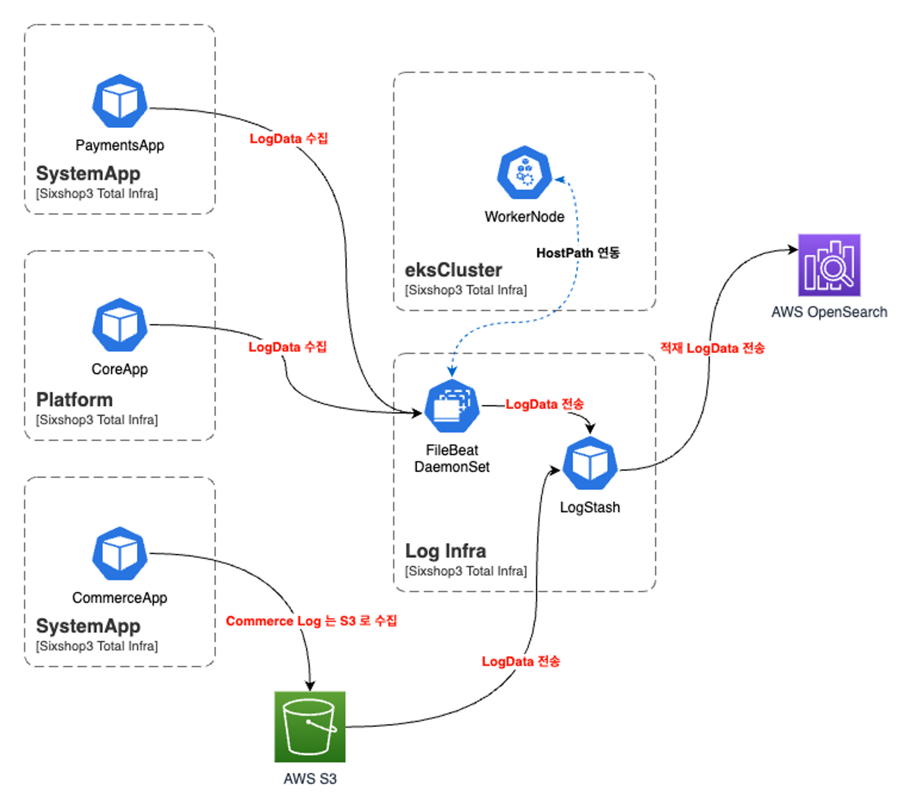
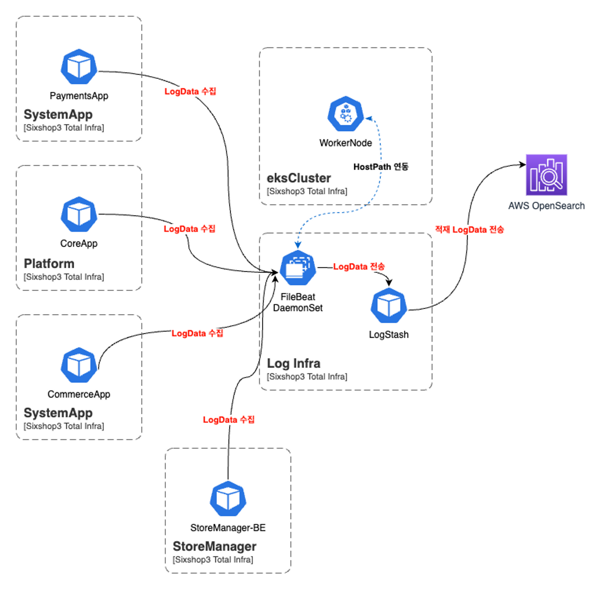
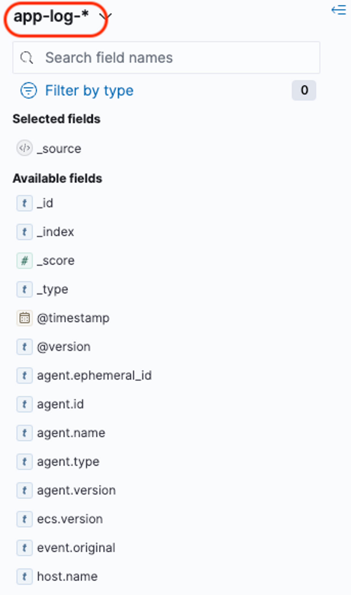
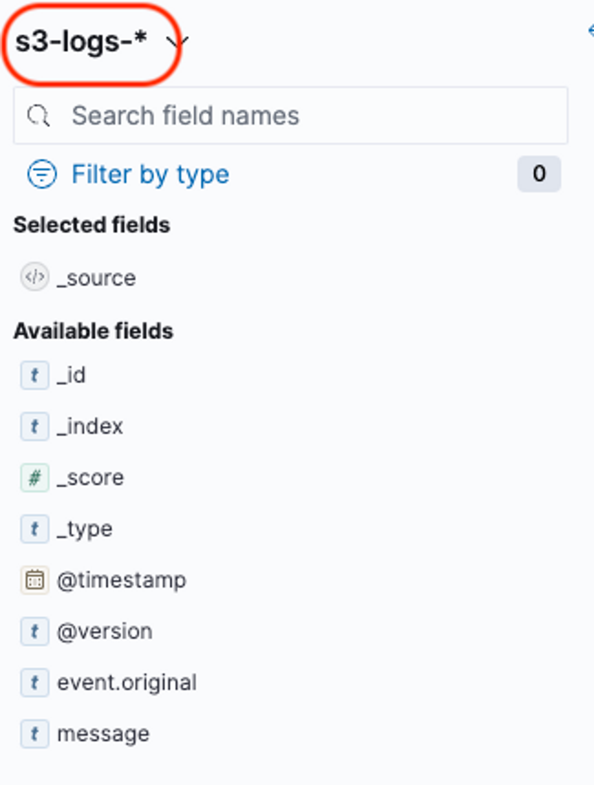

2023년 06월 ELK Stack
=================================================

# Summary
- Last Updated: 23.06.14 Wed
- Updated by: 황동욱

# 배경

통합 테스트 환경에서 사용할 통합 로그 시스템 로그 문서 입니다.

**참고 :** [식스샵3 ELK 스택 구축](elk_installation.md)

# 내용

### 아키텍처

각 애플리케이션들의 컨테이너 로그보다 애플리케이션 로그를 수집하는 것이 중요합니다.

대략적인 플로우는 아래와 같습니다.

- 이전의 구성

    <aside>
    📌 플랫폼은 로그를 자체적으로 서버 내에 떨굽니다.

    </aside>

    <aside>
    📌 커머스는 로그를 S3 로 떨굽니다.

    </aside>

    


<aside>
💡 커머스도 플랫폼과 같이 서버 내에 로그를 떨구는 방식으로 변경 될 수 있습니다.

</aside>



### 스택 버전

OpenSearch 는 AWS Managed OpenSearch 로 구성하며, FileBeat(로그 수집), Logstash(로그 전송)은 EKS Cluster 내에 Container 로 구성합니다.

| OpenSearch | FileBeat | Logstash |
| --- | --- | --- |
| ss3-dev-common-es | EKS | EKS |
| OpenSearch 2.3 | 8.4.0 | 8.4.0 |

### OpenSearch

OpenSearch Endpoint → https://secret.ap-northeast-2.es.amazonaws.com/

### FileBeat & Logstash

FileBeat 와 Logstash 는 각각 `커스텀 Helm Chart` 를 작성하여 구축합니다.

### 로그 수집

애플리케이션 Pod 의 로그 디렉터리는 EKS WorkerNode 의 볼륨과 연동하여 배포 합니다.

아래와 같이 `log-2023~.log` 를 확인 할 수 있습니다.

<aside>
📌 Node 의 hostPath **/var/log** 볼륨과 연동 됩니다.

</aside>

```bash
3.3M    amazon
1.4M    audit
16.8M   aws-routed-eni
72.0K   boot.log
0       btmp
4.0K    btmp-20230301.gz
3.2M    chrony
24.0K   cloud-init-output.log
100.0K  cloud-init.log
12.0K   containers
28.0K   cron
8.0K    cron-20230305.gz
8.0K    cron-20230312.gz
28.0K   dmesg
24.0K   dmesg.old
4.0K    grubby
4.0K    grubby_prune_debug
48.0M   journal
12.0K   lastlog
**808.0K  log-2023-03-xx.log**
```

### OpenSearch Dashboard

앱 로그와 S3 로그를 각각 분리된 Index 에 전송 되도록 합니다.

Index 를 추가한 뒤 아래와 같이 로그를 확인 합니다.



앱 로그



S3 로그

# 팀 별 필요 수집 대상

### 서비스 프로젝트 리스트

| 플랫폼 팀 | 앱 팀(결제) |
| --- | --- |
| Core | Payment module |
| User Store | Manager module |
| Developer Center | Manager Batch |
| 파일 서버 | Payment Consumer |
| Voldemort (payment) | SDK |
| App Store |  |
| Page Extension |  |

### 로그 위치

**플랫폼 팀 →** `/app/logs`

**앱 팀 (결제 앱) →** `/home/ec2-user/logs/service/`

## 플랫폼

- **Logstash**

    ```bash
    filter {
         if "CORE" in [tags] {
            grok {
              match => {
                "message" => "\[%{LOGLEVEL:logLevel}\s?\]\[%{GREEDYDATA:projectName}\s?\]\[%{GREEDYDATA:location}\]%{TIMESTAMP_ISO8601:logTime} %{GREEDYDATA:logData}"
              }
              remove_field => [ "event", "input", "log", "fields", "ecs", "cloud", "agent", "host", "message"]
            }

            json {
              source => "logData"
              skip_on_invalid_json => true
              tag_on_failure => true
              }
            }
          }
    ```


## 시스템앱

Logstash 는 Filebeat 의 `tags` 를 전달 받습니다.

- **Logstash**
    - As-IS

        ```bash
        input {
          beats {
            port => 5044
          }
        }

        filter {
          grok {
            patterns_dir => ["/home/ec2-user/logstash-7.16.3/config/conf.d/system-app.pattern"]
            match => { "message" => "%{APPLICATION_LOG}" }
          }

          grok {
            patterns_dir => ["/home/ec2-user/logstash-7.16.3/config/conf.d/system-app.pattern"]
            match => { "msg" => "%{LOG_DETAIL}" }
          }

          date {
            match => ["timeStamp", "yyyy-MM-dd HH:mm:ss.SSS", "ISO8601"]
          }
        }

        output {
         opensearch {
            hosts =>  ["https://secret.ap-northeast-2.es.amazonaws.com:443"]
            user  =>  "admin"
            password  =>  "Indreamin0136!!"
            index => "system-app-test-index-%{[fields][service]}-%{[fields][module]}-log-%{+YYYYMMdd}"
            ssl => true
            ecs_compatibility => "disabled"
          }
        }
        ```

        ```bash
        APPLICATION_LOG %{TIMESTAMP_ISO8601:timeStamp}%{SPACE}%{LOGLEVEL:logLevel}%{SPACE}%{NUMBER:processId}%{SPACE}---%{SPACE}(\[%{DATA:threadName}\])%{SPACE}%{GREEDYDATA:class}%{SPACE}(\[%{DATA:traceId}\])%{SPACE}:%{SPACE}%{GREEDYDATA:msg}
        LOG_DETAIL \[%{GREEDYDATA:logPrefix}\]%{SPACE}\[description\]\=%{GREEDYDATA:description}\[data\]\=%{GREEDYDATA:data}\[errorCode\]\=%{GREEDYDATA:errorCode}\[exception\]\=%{GREEDYDATA:exception}
        ```


    기존에 파일 형태로 전달 받던 패턴을 하나의 grok 패턴으로 합쳐서 필터 구성 했습니다.

    - To-Be

        ```bash
        filter {
              if "PAYMENT" in [tags] {
                grok {
                  match => {
                    "message" => "%{TIMESTAMP_ISO8601:timeStamp}%{SPACE}%{LOGLEVEL:logLevel}%{SPACE}%{NUMBER:processId}%{SPACE}---%{SPACE}(\[%{DATA:threadName}\])%{SPACE}%{GREEDYDATA:class}%{SPACE}(\[%{DATA:traceId}\])%{SPACE}:%{SPACE}%{GREEDYDATA:msg}"
                  }
                  remove_field => [ "event", "input", "ecs", "cloud", "agent", "host"]
                }

                grok {
                  match => {
                    "msg" => "\[%{GREEDYDATA:logPrefix}\]%{SPACE}\[description\]\=%{GREEDYDATA:description}\[data\]\=%{GREEDYDATA:data}\[errorCode\]\=%{GREEDYDATA:errorCode}\[exception\]\=%{GREEDYDATA:exception}"
                  }
                  remove_field => [ "event", "input", "ecs", "cloud", "agent", "host"]
                }

                date {
                  match => ["timeStamp", "yyyy-MM-dd HH:mm:ss.SSS", "ISO8601"]
                }
              }
            }
        ```

    - To-Be v2

        시스템앱에서 원하시는 `errorCode` `logPrefix` `exception` 필드가 출력되지 않아서 아래와 같이 수정 했습니다.

        ```bash
        filter {
              if "PAYMENT" in [tags] {
                grok {
                  match => {
                    "message" => "%{TIMESTAMP_ISO8601:timeStamp}%{SPACE}%{LOGLEVEL:logLevel}%{SPACE}%{NUMBER:processId}%{SPACE}---%{SPACE}(\[%{DATA:threadName}\])%{SPACE}%{GREEDYDATA:class}%{SPACE}(\[%{DATA:traceId}\])%{SPACE}:%{SPACE}%{GREEDYDATA:msg}"
                  }
                  remove_field => [ "event", "input", "ecs", "cloud", "agent", "host"]
                }

                grok {
                  match => {
                    "msg" => "\[%{GREEDYDATA:logPrefix}\]%{SPACE}\[description\]\=%{GREEDYDATA:description}\[data\]\=%{GREEDYDATA:data}\[errorCode\]\=%{GREEDYDATA:errorCode}\[exception\]\=%{GREEDYDATA:exception}"
                  }
                  remove_field => [ "event", "input", "ecs", "cloud", "agent", "host"]
                }

                date {
                  match => ["timeStamp", "yyyy-MM-dd HH:mm:ss.SSS", "ISO8601"]
                }

                mutate {
                  convert => {
                    "errorCode" => "integer"
                  }
                }
              }
            }
        ```

    - To-Be v3

         `errorCode` 가 0으로 찍히고 있어서 아래와 같이 수정 했습니다.

        ```bash
        filter {
                  if "PAYMENT" in [tags] {
                    grok {
                      match => {
                        "message" => "%{TIMESTAMP_ISO8601:timeStamp}%{SPACE}%{LOGLEVEL:logLevel}%{SPACE}%{NUMBER:processId}%{SPACE}---%{SPACE}(\[%{DATA:threadName}\])%{SPACE}%{GREEDYDATA:class}%{SPACE}(\[%{DATA:traceId}\])%{SPACE}:%{SPACE}%{GREEDYDATA:msg}"
                      }
                      remove_field => [ "event", "input", "ecs", "cloud", "agent", "host"]
                    }

                    grok {
                      match => {
                        "msg" => "\[%{GREEDYDATA:logPrefix}\]%{SPACE}\[description\]\=%{GREEDYDATA:description}\[data\]\=%{GREEDYDATA:data}\[errorCode\]\=%{GREEDYDATA:errorCode}\[exception\]\=%{GREEDYDATA:exception}"
                      }
                      remove_field => [ "event", "input", "ecs", "cloud", "agent", "host"]
                    }

                    date {
                      match => ["timeStamp", "yyyy-MM-dd HH:mm:ss.SSS", "ISO8601"]
                    }

                    mutate {
                        convert => {
                            "data" => "string"
                            "errorCode" => "string"
                        }
                    }
                  }
                }
        ```


# 참고 링크

https://www.elastic.co/guide/en/logstash/current/plugins-filters-mutate.html#plugins-filters-mutate-convert

