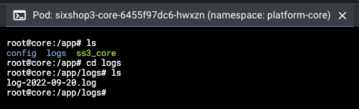
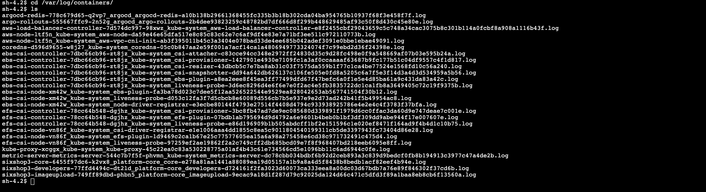
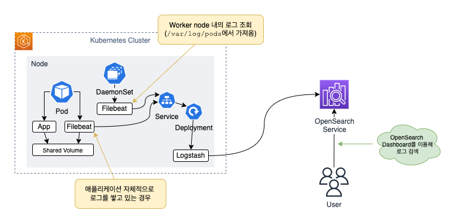
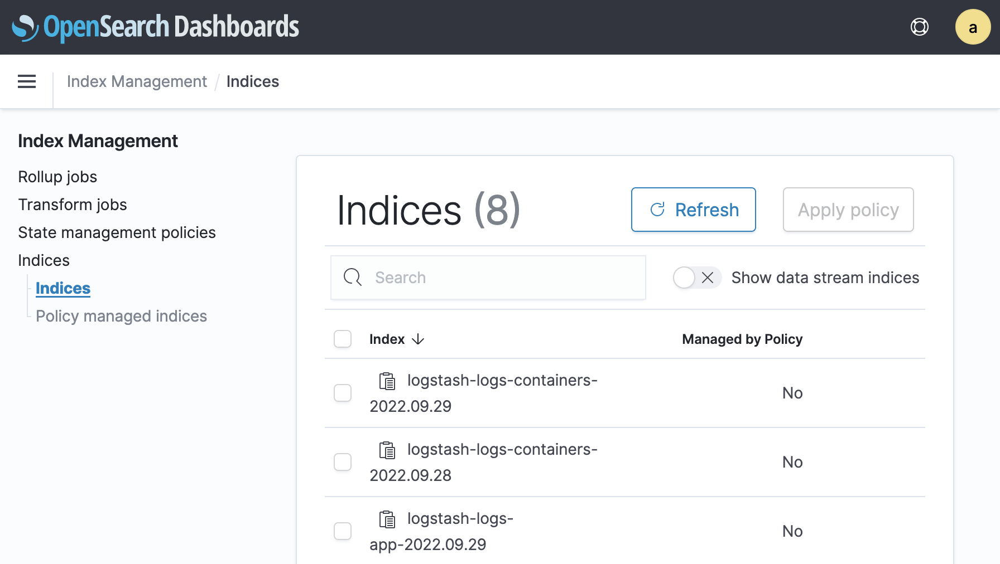

2023년 06월 ELK Stack
=================================================

# Summary
- Last Updated: 23.06.14 Wed
- Updated by: 황동욱

# 식스샵3 ELK 스택 구축

# 배경

→ 플랫폼 팀, 앱 팀(시스템 앱)에서 Elasticsearch 기반의 로깅 시스템 구축을 원하는 상태임

# 컨테이너 로그는 어떻게 저장하고 있을까?

코어의 경우 로그 저장 위치: `/app/logs/log-YYYY-MM-DD.log`



EKS에서 컨테이너 로그가 저장되는 위치: `/var/log/pods` ([참고자료](https://kubernetes.io/docs/concepts/cluster-administration/logging/#log-location-node))

- Docker 컨테이너 로그는 `/var/log/containers` 에 저장됨 ([참고자료](https://logz.io/blog/a-practical-guide-to-kubernetes-logging/))
- 현재 컨테이너 런타임이 Docker이므로 `/var/log/containers` 디렉터리에도 저장되는 것으로 보임



# 설계



# 구축 테스트

## Filebeat

<aside>
📜 [**Run Filebeat on Kubernetes**](https://www.elastic.co/guide/en/beats/filebeat/current/running-on-kubernetes.html) 문서를 참고하세요.

</aside>

→ Filebeat 설정과 관련해서 참고할 자료: [Sixshop2의 Filebeat 설정](https://github.com/sixshop/sixshop2/blob/master/_provisioning/.ebextensions/sixshop2.config.sample#L104)

**Filebeat Docker 이미지 다운로드**

- OpenSearch와 호환되는 버전: [문서](https://opensearch.org/docs/latest/clients/agents-and-ingestion-tools/index/#compatibility-matrix-for-beats) 참조
- Beat 7.13 버전 이후로 OpenSearch로 데이터를 내보내는 기능을 지원하지 않음에 유의

    → OpenSearch Output Plugin이 있는 Logstash를 설치하고, Logstash로 데이터를 보내는 방법으로 우회할 수 있음


```bash
$ docker pull docker.elastic.co/beats/filebeat:8.4.2
```

**Filebeat 설정**

- 기본적으로 `/usr/share/filebeat` 디렉터리에서 실행함
- `/usr/share/filebeat/filebeat.yml` 파일을 편집하여 설정 변경

```bash
filebeat@f8d862f2c1a3:~$ pwd
/usr/share/filebeat
filebeat@f8d862f2c1a3:~$ cat filebeat.yml
filebeat.config:
  modules:
    path: ${path.config}/modules.d/*.yml
    reload.enabled: false

processors:
  - add_cloud_metadata: ~
  - add_docker_metadata: ~

output.elasticsearch:
  hosts: '${ELASTICSEARCH_HOSTS:elasticsearch:9200}'
  username: '${ELASTICSEARCH_USERNAME:}'
  password: '${ELASTICSEARCH_PASSWORD:}'
filebeat@f8d862f2c1a3:~$
```

Filebeat의 input

- [Container input](https://www.elastic.co/guide/en/beats/filebeat/current/filebeat-input-container.html): 컨테이너 로그 파일을 읽는 input 임

## Logstash

- Logstash 설정과 관련한 사항은 아래 이슈 및 문서 참조
    - https://sixshop.atlassian.net/browse/DO-125: 웹/애플리케이션 로그 분석 시스템 구축 PoC
    - [식스샵2 로그 분석 시스템](s2_elk_doc.md)
- Logstash와 OpenSearch 호환 여부: [문서](https://opensearch.org/docs/latest/clients/agents-and-ingestion-tools/index/#compatibility-matrix-for-logstash) 참조

**Logstash + OpenSearch Output Plugin Docker 이미지 받기**

```bash
docker pull opensearchproject/logstash-oss-with-opensearch-output-plugin:8.4.0
```

**Logstash 설정**

- 기본적으로 `/usr/share/logstash` 디렉터리에서 실행함
- `/usr/share/logstash/pipeline/logstash.conf` 파일을 변경하여 설정 변경

```bash
logstash@cd0d212934ce:~$ cd pipeline/
logstash@cd0d212934ce:~/pipeline$ pwd
/usr/share/logstash/pipeline
logstash@cd0d212934ce:~/pipeline$ cat logstash.conf
input {
  beats {
    port => 5044
  }
}

output {
  stdout {
    codec => rubydebug
  }
}
```

## OpenSearch

→ Database용 Private Subnet에 생성하여야 하나, 테스트를 위해 임시로 Public Subnet에 생성

# Helm Chart로 만들기

## Kubernetes Secret 생성

계정 정보가 코드에 노출되는 것을 방지하기 위해 Secret 객체를 생성합니다.

<aside>
📜 [kubectl을 사용한 시크릿 관리](https://kubernetes.io/ko/docs/tasks/configmap-secret/managing-secret-using-kubectl/), Kubernetes의 [시크릿(Secret)](https://kubernetes.io/ko/docs/concepts/configuration/secret/) 문서를 참고하세요.

</aside>

1. 사용자 이름과 비밀번호를 각각의 파일로 만듭니다. (이번 PoC에서는 `opensearch_username.txt`, `opensearch_password.txt` 파일을 생성합니다)
2. 다음과 같이 명령을 실행합니다.

    ```bash
    $ kubectl create secret generic opensearchaccount \
    		--from-file=username=opensearch_username.txt \
    		--from-file=password=opensearch_password.txt \
    		--namespace kube-system
    # Output
    secret/opensearchaccount created
    ```

3. 생성 여부를 확인합니다.

    ```bash
    $ kubectl describe secrets --namespace kube-system opensearchaccount
    # Output
    Name:         opensearchaccount
    Namespace:    kube-system
    Labels:       <none>
    Annotations:  <none>

    Type:  Opaque

    Data
    ====
    password:  9 bytes
    username:  5 bytes
    ```


## Worker Node에 대한 Filebeat + Logstash 구성

- sixshop3-helm-charts 저장소 참조
    - Filebeat, Logstash 설정: `ss3-dev-elk/templates/configmap.yaml` 참조
    - 참고: Role 및 ClusterRole을 Filebeat의 Service Account에 부여해야 노드 및 Pod 정보를 얻을 수 있음
    - → 펼쳐서 Filebeat 로그 보기

        ```
        W0929 23:41:21.955567       7 reflector.go:324] pkg/mod/k8s.io/client-go@v0.23.4/tools/cache/reflector.go:167: failed to list *v1.Node: nodes "lima-rancher-desktop" is forbidden: User "system:serviceaccount:kube-system:filebeat" cannot list resource "nodes" in API group "" at the cluster scope
        E0929 23:41:21.956025       7 reflector.go:138] pkg/mod/k8s.io/client-go@v0.23.4/tools/cache/reflector.go:167: Failed to watch *v1.Node: failed to list *v1.Node: nodes "lima-rancher-desktop" is forbidden: User "system:serviceaccount:kube-system:filebeat" cannot list resource "nodes" in API group "" at the cluster scope
        W0929 23:41:22.800648       7 reflector.go:324] pkg/mod/k8s.io/client-go@v0.23.4/tools/cache/reflector.go:167: failed to list *v1.Node: nodes "lima-rancher-desktop" is forbidden: User "system:serviceaccount:kube-system:filebeat" cannot list resource "nodes" in API group "" at the cluster scope
        E0929 23:41:22.800825       7 reflector.go:138] pkg/mod/k8s.io/client-go@v0.23.4/tools/cache/reflector.go:167: Failed to watch *v1.Node: failed to list *v1.Node: nodes "lima-rancher-desktop" is forbidden: User "system:serviceaccount:kube-system:filebeat" cannot list resource "nodes" in API group "" at the cluster scope
        {"log.level":"error","@timestamp":"2022-09-29T23:41:24.622Z","log.logger":"publisher_pipeline_output","log.origin":{"file.name":"pipeline/client_worker.go","file.line":150},"message":"Failed to connect to backoff(async(tcp://logstash:5044)): dial tcp 10.43.44.107:5044: connect: connection refused","service.name":"filebeat","ecs.version":"1.6.0"}
        W0929 23:41:25.191058       7 reflector.go:324] pkg/mod/k8s.io/client-go@v0.23.4/tools/cache/reflector.go:167: failed to list *v1.Node: nodes "lima-rancher-desktop" is forbidden: User "system:serviceaccount:kube-system:filebeat" cannot list resource "nodes" in API group "" at the cluster scope
        E0929 23:41:25.191353       7 reflector.go:138] pkg/mod/k8s.io/client-go@v0.23.4/tools/cache/reflector.go:167: Failed to watch *v1.Node: failed to list *v1.Node: nodes "lima-rancher-desktop" is forbidden: User "system:serviceaccount:kube-system:filebeat" cannot list resource "nodes" in API group "" at the cluster scope
        {"log.level":"error","@timestamp":"2022-09-29T23:41:28.209Z","log.logger":"publisher_pipeline_output","log.origin":{"file.name":"pipeline/client_worker.go","file.line":150},"message":"Failed to connect to backoff(async(tcp://logstash:5044)): dial tcp 10.43.44.107:5044: connect: connection refused","service.name":"filebeat","ecs.version":"1.6.0"}
        W0929 23:41:29.747689       7 reflector.go:324] pkg/mod/k8s.io/client-go@v0.23.4/tools/cache/reflector.go:167: failed to list *v1.Node: nodes "lima-rancher-desktop" is forbidden: User "system:serviceaccount:kube-system:filebeat" cannot list resource "nodes" in API group "" at the cluster scope
        E0929 23:41:29.747776       7 reflector.go:138] pkg/mod/k8s.io/client-go@v0.23.4/tools/cache/reflector.go:167: Failed to watch *v1.Node: failed to list *v1.Node: nodes "lima-rancher-desktop" is forbidden: User "system:serviceaccount:kube-system:filebeat" cannot list resource "nodes" in API group "" at the cluster scope
        {"log.level":"error","@timestamp":"2022-09-29T23:41:33.784Z","log.logger":"publisher_pipeline_output","log.origin":{"file.name":"pipeline/client_worker.go","file.line":150},"message":"Failed to connect to backoff(async(tcp://logstash:5044)): dial tcp 10.43.44.107:5044: connect: connection refused","service.name":"filebeat","ecs.version":"1.6.0"}
        W0929 23:41:41.918845       7 reflector.go:324] pkg/mod/k8s.io/client-go@v0.23.4/tools/cache/reflector.go:167: failed to list *v1.Node: nodes "lima-rancher-desktop" is forbidden: User "system:serviceaccount:kube-system:filebeat" cannot list resource "nodes" in API group "" at the cluster scope
        E0929 23:41:41.919336       7 reflector.go:138] pkg/mod/k8s.io/client-go@v0.23.4/tools/cache/reflector.go:167: Failed to watch *v1.Node: failed to list *v1.Node: nodes "lima-rancher-desktop" is forbidden: User "system:serviceaccount:kube-system:filebeat" cannot list resource "nodes" in API group "" at the cluster scope
        {"log.level":"error","@timestamp":"2022-09-29T23:41:43.167Z","log.logger":"publisher_pipeline_output","log.origin":{"file.name":"pipeline/client_worker.go","file.line":150},"message":"Failed to connect to backoff(async(tcp://logstash:5044)): dial tcp 10.43.44.107:5044: connect: connection refused","service.name":"filebeat","ecs.version":"1.6.0"}
        W0929 23:41:58.080122       7 reflector.go:324] pkg/mod/k8s.io/client-go@v0.23.4/tools/cache/reflector.go:167: failed to list *v1.Node: nodes "lima-rancher-desktop" is forbidden: User "system:serviceaccount:kube-system:filebeat" cannot list resource "nodes" in API group "" at the cluster scope
        E0929 23:41:58.080293       7 reflector.go:138] pkg/mod/k8s.io/client-go@v0.23.4/tools/cache/reflector.go:167: Failed to watch *v1.Node: failed to list *v1.Node: nodes "lima-rancher-desktop" is forbidden: User "system:serviceaccount:kube-system:filebeat" cannot list resource "nodes" in API group "" at the cluster scope
        {"log.level":"error","@timestamp":"2022-09-29T23:42:11.140Z","log.logger":"publisher_pipeline_output","log.origin":{"file.name":"pipeline/client_worker.go","file.line":150},"message":"Failed to connect to backoff(async(tcp://logstash:5044)): dial tcp 10.43.44.107:5044: connect: connection refused","service.name":"filebeat","ecs.version":"1.6.0"}
        {"log.level":"info","@timestamp":"2022-09-29T23:42:11.141Z","log.logger":"publisher_pipeline_output","log.origin":{"file.name":"pipeline/client_worker.go","file.line":141},"message":"Attempting to reconnect to backoff(async(tcp://logstash:5044)) with 5 reconnect attempt(s)","service.name":"filebeat","ecs.version":"1.6.0"}
        ```

- 다음과 같은 이슈가 있었음
    - Logstash의 경우 CPU/메모리 용량을 제한하면 실행하지 못하는 현상이 있음 → 리소스를 제한하는 경우, 높은 사양을 제공할 필요가 있음

## Pod 내부에 Sidecar로 Filebeat 구성

- 하나의 Helm Chart에 Logstash와 Filebeat를 같이 구성하는 경우, Logstash가 늦게 올라오기 때문에 로그가 제대로 전송되지 않는 경우가 있을 수 있음
- 이에 별도의 Chart로 분리해서 구성
- 간단하게 테스트 환경을 구성하기 위해, 식스샵3 Userstore 컨테이너 이미지를 이용
- sixshop3-helm-charts 저장소의 참조
    - Pod 설정 요약
        - Volume을 구성
        - 각각의 컨테이너에 Volume을 마운트
- 테스트 시 다음 순서대로 Chart를 설치 (`helm install <RELEASE_NAME> <CHART_PATH>`)
    - `ss3-dev-elk`
    - `ss3-dev-elk-application`

## 여러 로그 소스에 따라 분리하기

- 컨테이너 런타임에서 제공하는 컨테이너 로그와 애플리케이션이 저장하는 로그를 분리할 필요가 있음
    - 애플리케이션 간 로그 저장 방식이 다르기 때문
- sixshop3-helm-charts 저장소 참조
    - 컨테이너 런타임에서 제공하는 컨테이너 로그: `logstash-logs-containers-YYYY.MM.dd`
    - 애플리케이션이 저장하는 로그: `logstash-logs-app-YYYY.MM.dd`
- OpenSearch의 Index Management → Indices 메뉴로 확인해 보면, 아래와 같이 인덱스가 분리됨

    


# 참고자료

- [Docker @ Elastic](https://www.docker.elastic.co/)
    - Elasticsearch, Kibana, Beats, Logstash 등의 Docker Image 제공
- [Docker: opensearchproject/logstash-oss-with-opensearch-output-plugin](https://hub.docker.com/r/opensearchproject/logstash-oss-with-opensearch-output-plugin)
    - OpenSearch로 데이터 내보내기를 지원하는 Logstash 버전

## Logstash

- [Logstash를 사용하여 Amazon OpenSearch Service로 데이터 로드](https://docs.aws.amazon.com/ko_kr/opensearch-service/latest/developerguide/managedomains-logstash.html)
- [Using environment variables](https://www.elastic.co/guide/en/logstash/current/environment-variables.html)

## 여러 로그 소스에 따라 분리하기

- [Multiple filebeat to one logstash, How to optimize the configuration?](https://stackoverflow.com/questions/58742845/multiple-filebeat-to-one-logstash-how-to-optimize-the-configuration)
- (Filebeat) [Configure general settings - `tags`](https://www.elastic.co/guide/en/beats/filebeat/current/configuration-general-options.html#_tags_21)
- (Logstash) [Accessing event data and fields - Conditionals](https://www.elastic.co/guide/en/logstash/current/event-dependent-configuration.html#conditionals)
- (Elastic) [How to configure different indexes in logstash](https://discuss.elastic.co/t/how-to-configure-different-indexes-in-logstash/58665/3)
