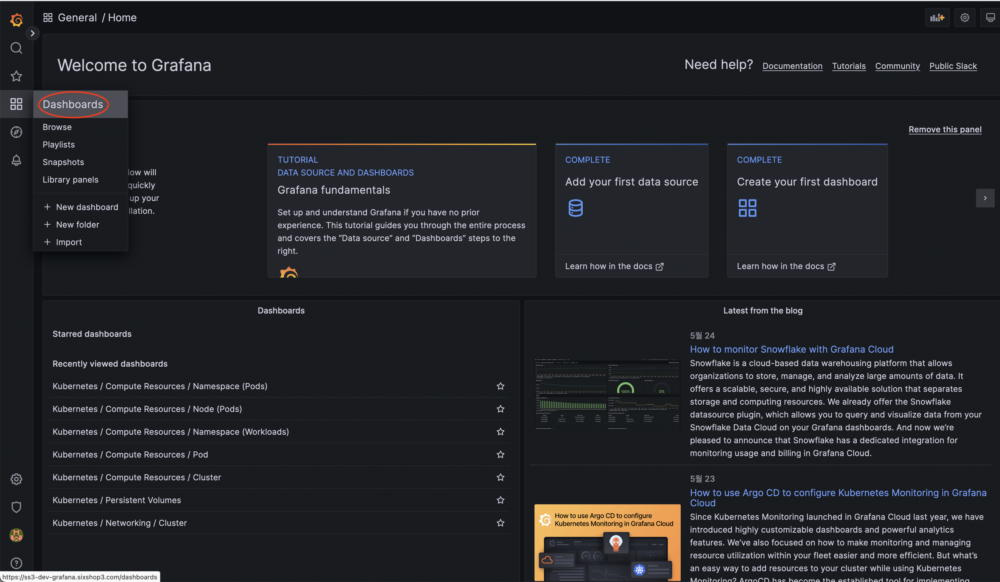
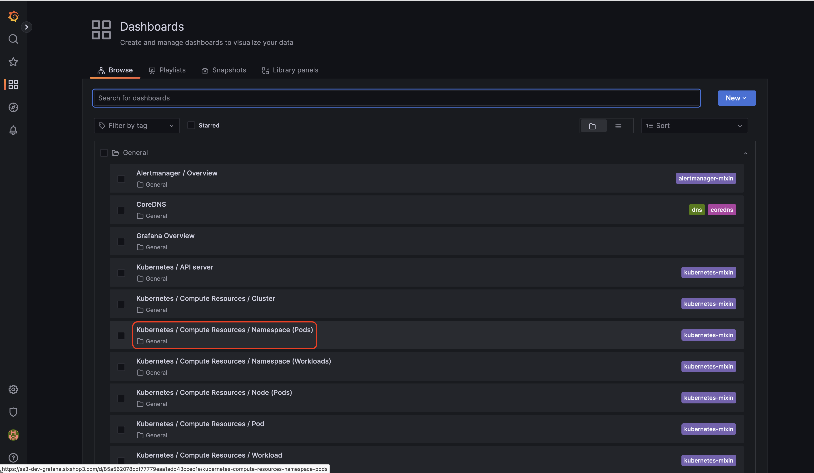
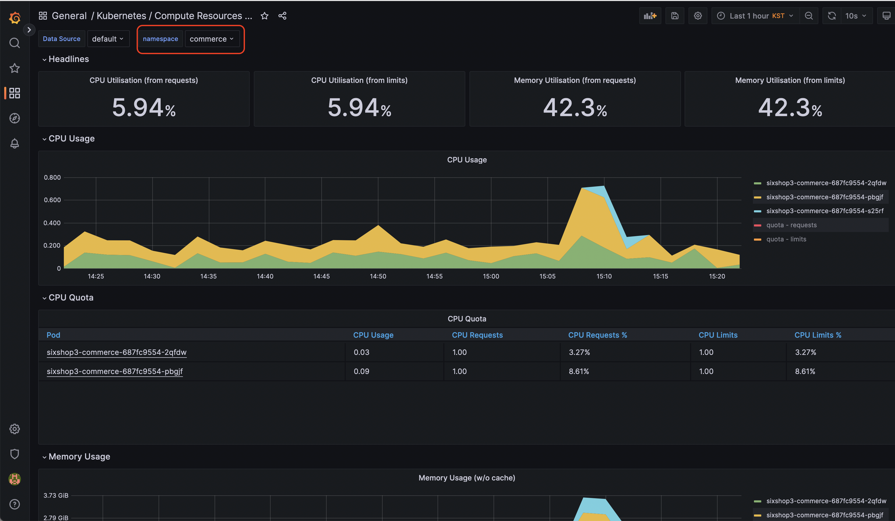

2023년 06월 System Monitoring
==============================

# Summary
- Last Updated: 23.06.14 Wed
- Updated by: 황동욱

# EKS 통합 시스템 모니터링 (Prometheus, Grafana)

# 배경

EKS에 관련된 Worker Node와 각 서비스 별 Pods에 대한 CPU, Memory, Network I/O와 같은 기본적인 시각화하여 볼 수 있는게 필요

# 설치

- 을 이용한 Prometheus와 Grafana 설치 ([링크](https://prometheus-community.github.io/helm-charts))
- Helm을 이용한 ebs-csi-driver 설치 ([링크](https://kubernetes-sigs.github.io/aws-ebs-csi-driver))
    - Prometheus와 Grafana에 gp3 유형을 사용하기 위한 설치 진행
    - Prometheus에 경우 볼륨이 100GB로 되어있으며 70GB가 되거나 5일치만 저장하도록 설정되어 있음
    - Grafana에 경우 볼륨이 100GB로 되어있으며 configuration 저장 용도

```bash
# 프로메테우스&그라파나
$ helm repo add prometheus-community https://prometheus-community.github.io/helm-charts
$ helm repo update
$ helm pull prometheus-community/kube-prometheus-stack
$ tar xvfz kube-prometheus-stack-45.19.0.tgz
##통테
$ helm install prometheus-stack prometheus-community/kube-prometheus-stack -n monitoring -f monitor-value.yaml --set grafana.adminPassword=secret
##운영
$ helm install prometheus-stack prometheus-community/kube-prometheus-stack -n monitoring -f monitor-value.yaml --set grafana.adminPassword=secret
$ helm delete prometheus-stack -n monitoring
$ helm show values prometheus-community/kube-prometheus-stack | grep adminPassword

# ebs-csi-driver 설치
$ helm repo add aws-ebs-csi-driver https://kubernetes-sigs.github.io/aws-ebs-csi-driver
$  helm repo update aws-ebs-csi-driver \
&& helm search repo aws-ebs-csi-driver/aws-ebs-csi-driver -l | head -n 10
$ helm install aws-ebs-csi-driver aws-ebs-csi-driver/aws-ebs-csi-driver

# ebs storage class gp3 설정
$ helm show values aws-ebs-csi-driver/aws-ebs-csi-driver > aws-ebs-csi-driver-values.yaml
$ aws-ebs-csi-driver-values.yaml에서 storageclass 부분 수정
$ helm upgrade aws-ebs-csi-driver aws-ebs-csi-driver/aws-ebs-csi-driver -n kube-system -f aws-ebs-csi-driver-values.yaml
```

# 설정

- Grafana
    - Slack 연동 : [Alerting] - [Contact points]
        - 통합 테스트 : **#개발_그라파나**
        - 운영 : **#운영_그라파나**
    - 알람 : [Alerting] - [Alert rules]
        - 기준
            - 각 Pod 및 Worker Node에 CPU와 Memory 80%이상
            - 1분마다 지난 5분 동안 수집된 데이터를 기반으로 그룹의 경고 규칙이 평가하여 슬랙으로 알람 전달
    - User 생성 및 권한

# 도메인

**[통합 테스트]**

- Prometheus : secret
- Grafana : secret

**[운영]**

- Prometheus : secret
- Grafana : secret

# 모니터링 방법

1. 좌측 상단에 4번째 아이콘에서 **`[Dashboards]`** 클릭



2. 6번째 `**Kubernetes / Compute Resources / Namespace (Pods)**` 클릭



3. `namespace` 에서 각 팀에 맞는 Namespace를 클릭
    - 시스템 앱 : `system-app`
    - 플랫폼 : `platform-core`, `platform-image`



4. 각 Pod 별 CPU, Memory에 대한 메트릭 확인

# CPU, Memory Percentage 쿼리문

## Worker Node

### CPU
```
100 * (1 - avg by(instance) (irate(node_cpu_seconds_total{mode="idle"}[5m])))
```

### Memory
```
100 * (1 - avg_over_time(node_memory_MemAvailable_bytes[5m]) / avg_over_time(node_memory_MemTotal_bytes[5m]))
```

##Pod

## Worker Node

### CPU
```
100 * max(
  rate(container_cpu_usage_seconds_total[5m])
    / on (container, pod) group_left(label_pod)
  label_replace(kube_pod_container_resource_limits{resource="cpu"}, "pod", "$1", "exported_pod", "(.+)")
) by (pod, label_pod)
```

### Memory
```
100 * max(
  container_memory_working_set_bytes
    / on (container, pod) group_left(label_pod)
  label_replace(kube_pod_container_resource_limits{resource="memory"}, "pod", "$1", "exported_pod", "(.+)")
) by (pod, label_pod)
```
